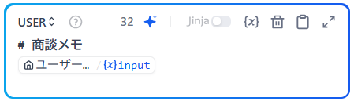

# 1_商談メモからの製品選定ワークフロー

このドキュメントは、Dify でワークフローを作成するための演習手順書です。

## 1. 説明

顧客との商談メモを入力すると、AIが内容を構造的に整理し、自社商品の中から最適な提案候補を自動で選定するワークフローです。
「情報の整理」と「戦略的な製品選定」のステップを分けることで、単なる要約に留まらない、営業現場で即戦力となる提案支援アウトプットを作成します。

??? Tip "Tips：モデルによる設定の違い"
    GPTモデルとGeminiモデルでは設定内容に違いがあります。
    特にワークフローやチャットフローのLLMノードでは、GPTモデルはSYSTEMプロンプトのみ必須ですが、GeminiモデルではUSERプロンプトが必須です。この演習手順ではGeminiモデルをデフォルトにしているため、USERプロンプトを設定する手順となっています。

## 2. 使用するノード

1. **LLMノード①（整理担当）**: メモから課題や制約を抽出。
2. **知識検索ノード**: 整理された課題に基づき、関連する製品情報をナレッジから取得。
3. **LLMノード②（選定担当）**: 取得した製品群から、なぜその製品が最適か、あるいはなぜ不採用かを論理的に判断。

---

## 3. Dify設定手順

### 手順①：ナレッジの構築

!!! success "演習環境では事前に登録済みなのでこの作業は不要です。"

1. Dify上部メニューの「**ナレッジ**」をクリック ⇒ 「**ナレッジベースを作成**」をクリック 。
2. 「**ファイルまたはフォルダをドラッグアンドドロップ**」の部分に「**product_list_solution.csv**」をアップロードして「**次へ**」 。
3. **チャンク設定**：デフォルトのまま「**チャンクをプレビュー**」をクリック。画面右に表示されるプレビューで、商品情報が並ぶのを確認する。
4. **インデックス方法**：デフォルトのまま「**高品質**」を選択。
5. **埋め込みモデル**: デフォルトのまま「**text-embedding-3-small**」を選択。
6. **検索設定**: 「**ハイブリッド検索**」を選択。詳細の設定はデフォルトのまま。
7. **保存して処理**をクリック。
8. **埋め込みが完了しました**と表示されたら先に進みます。

### 手順②：ワークフローアプリの作成

1. 上部メニューから「**スタジオ**」を選択。
2. 「**最初から作成**」→「**ワークフロー**」を選択。  
3. **アプリ名**：ワークフロー：商談メモから製品選定ワークフロー
4. **説明**：商談メモをもとに自社製品のなかからどの製品を提案すべきか製品の選定およびその理由を説明します。
5. 「**作成する**」をクリック 。

### 手順③：ワークフローの設定

**開始ノード**として「**ユーザー入力**」を選択してワークフローの構築を開始します。  
ワークフローのキャンバス上には、**ユーザー入力ノード**だけが配置されている状況です。
以下の作業を行い、ノードを順に配置・設定していきます。

#### 1. ユーザー入力ノード

1. ワークフローの編集画面で**ユーザー入力ノード**を選択します。  
以下の操作は、画面の右に出る設定画面で行います。
2. 「**入力フィールド**」の「**+**」をクリックして、入力フィールドを設定します。
      1. **タイプ**：段落
      2. **変数名**：`input`
      3. **ラベル名**：商談メモ入力
      4. **最大長**：3000
      5. **デフォルト値**：
      ```
      商談メモをそのまま入力してください。
      箇条書きで構いません。
      ```
      6. **必須**をチェック
      7. **保存**をクリック

#### 2. LLM①ノード（商談内容の整理）

1. ユーザー入力ノードの右にある「**+**」をクリックして、表示される一覧から「**LLM**」を選んでLノードを追加します。
以下の操作は、画面の右に出る設定画面で行います。
2. 設定画面の上部の「**LLM**」と記載されている部分がノード名です。役割がわかりやすいようにノード名を「**LLM①商談内容の整理**」に変更します。
3. **モデル**：`gemini-3.0-flash-preview`
4. **システムプロンプト（SYSTEM）**：
        ```markdown
        # 役割
        あなたは経験豊富な営業アシスタントです。
        以下の商談メモを読み、内容を「判断に使える形」に整理してください。

        # 重要ルール
        ・提案内容や製品名は一切書かない
        ・推測や補完はしない
        ・文章は簡潔に、箇条書きで出力する
        ・商談メモに書かれていない事実は追加しない

        # 出力項目
        ・顧客の主な課題
        ・制約条件（人・予算・期限・体制など）
        ・顧客が重視しているポイント
        ・現時点で不明な点／確認が必要な点
        ```

5. **ユーザープロンプト（USER）**：
**+メッセージ追加**をクリックします。すると、USERの入力が表示されます。USERに以下を入力します。
        ```markdown
        # 商談メモ
        {{input}}
        ```
???+ info "↑{{変数}}の設定部分は手入力の必要があります"
    上記の**{{input}}**の部分は、ユーザー入力ノードで作成した変数を指定するものです。
    コピーペーストするだけでは認識されないので、{{input}}の部分は手入力で「**{**」または「**/**」を入力して表示される変数候補の中からinputを選んでください。
    この方法は、以下のノード設定でも共通です。

完成したユーザー入力欄は以下のようになります。


#### 3. 知識検索ノード

1. 作成したLLMノードの右にある「**+**」をクリックして、表示される一覧から「**知識検索**」を選んでノードを追加します。
以下の操作は、画面の右に出る設定画面で行います。
2. 設定画面上部のノード名を「**知識検索_製品ラインナップ**」に変更します。
3. **クエリテキスト**：クリックして`#LLM①商談内容の整理の text`（LLM1の出力）を選択。
4. **ナレッジベース**：手順①で作成した「**product_list_solution**」を選択して**追加**をクリック。

#### 4. LLM②ノード（製品候補の選定）

1. 作成した知識検索ノードの右にある「**+**」をクリックして、表示される一覧から「**LLM**」を選んでノードを追加します。
以下の操作は、画面の右に出る設定画面で行います。
2. 設定画面上部のノード名を「**LLM②製品候補の選定**」に変更します。
3. **モデル**：`gemini-3.0-flash-preview`
4. **コンテキスト**：クリックして`{{#知識検索_製品ラインナップ result`（知識検索の出力）を選択。
5. **システムプロンプト（SYSTEM）**：
        ```markdown
        # 役割
        あなたは経験豊富な営業担当です。
        以下の情報をもとに、「売るべき製品候補」を検討してください。

        # 判断ルール
        ・1つに決めなくてよい（複数候補可）
        ・「なぜ候補になるか」を必ず書く
        ・「なぜ選ばなかったか」も必ず書く
        ・ナレッジに書かれていない製品は出さない
        ・断定しすぎず、営業として妥当な表現にする

        # 出力形式
        ■ 候補となる製品
        ■ 今回選ばなかった製品
        ■ 注意点・リスク
        ■ 追加で確認すべき質問
        ```

6. **ユーザープロンプト（USER）**：  
**+メッセージ追加**をクリックします。すると、USERの入力が表示されます。USERに以下を入力します。
        ```markdown
        # 入力情報
        ・商談内容の整理結果：
        {{#LLM①.text#}}

        ・製品ラインナップのナレッジ：
        {{#context#}}
        ```

??? info "↑{{変数}}の設定部分は手入力の必要があります"
    上記の**{{変数名}}**の部分は、これ以前のノードで設定した変数を指定するものです。
    コピーペーストするだけでは認識されないので、手入力で「**{**」または「**/**」を入力して表示される変数候補の中から選んでください。

#### 5. 終了ノード

1. 作成したLLMノードの右にある「**+**」をクリックして、表示される一覧から「**出力**」を選んでノードを追加します。
以下の操作は、画面の右に出る設定画面で行います。
2. 出力変数の右の「**+**」をクリックして、以下二つの出力変数を設定します。ワークフローを実行した際に、ここに設定した出力変数が順に出力されます。
      1. **LLM1_result**：`LLM①商談内容の整理 text`
      2. **LLM2_result**：`LLM②製品候補の選定 text`

### 手順④：保存する

画面右上の「**公開する**」→「**更新を公開**」をクリックします。変更が保存されます。

!!! Warning
    Dify では、上記の保存作業を行うと、保存とともに公開設定がされ、  
    環境によっては **Dify にログインしていないユーザーでもアプリにアクセス可能** になります。

    限定したい場合は、左上のアプリ名をクリックし、**Web App とバックエンドサービス APIをオフ**にしてください。  
    ※ 公開可否や利用範囲については、事前に管理者へ確認してください。

---

## 4. 動作確認

画面右上のテスト実行をクリックし、作成したワークフローのプレビュー画面を開き、以下の3つの商談メモを入力して、意図した通りの分析・提案が行われるか確認してください。

---

### 商談メモ①：事務部門の効率化とコスト削減（初級）

#### 入力

```text
【商談日】2024/11/12  
【訪問先】A社 総務部  
【参加者】A社：総務担当2名／当社：私

・冒頭で雑談。最近紙の値段が上がっていて、コピー用紙の発注も大変との話。
・総務の方から「申請書が多くて処理が追いつかない」という話が出た。
・現在は稟議、出張申請、備品申請などほぼすべて紙で回している。
・承認者が不在だと書類が止まることが多いらしい。
・IT担当は情シス兼任の方が1名いるだけ。「難しいシステムは正直困る」との発言あり。
・年度末までに何か改善できるとありがたい。予算は多少なら検討できる。

```

#### 模範出力（ポイント解説）
※ 主に以下のような点が出力されますが、完全に一致するわけではありません。

##### **LLM①（商談内容の整理）の要点**
* **主な課題**：紙ベースの申請業務による停滞と、用紙代の高騰に伴うコスト負担
* **制約条件**：IT担当者が1名のみ。複雑なシステム導入は困難
* **重視ポイント**：年度末までの短期間での改善効果


##### **LLM②（製品候補の選定）の要点**
* **推奨品2：スマート経費精算**。AI自動読取で事務作業を効率化し、IT担当が少なくても運用しやすい
* **推奨品3：ペーパーレスSCAN**。大量の紙書類を1日で電子化し、年度末までの迅速な環境改善を実現する

---

### 商談メモ②：組織の活性化と目に見えない疲弊（中級・ノイズあり）

#### 入力

```text
【商談日】2024/11/18  
【訪問先】B社 人事総務課  
【参加者】B社：課長1名／当社：私

・「最近近所のランチ代が高くなって、お弁当派が増えた」という雑談。
・課長曰く、最近の中途採用者は「会社の雰囲気が静かすぎて、誰が何を考えているか不安」と言って数ヶ月で辞めてしまう例がある。
・「オフィスが寒暖差で集中しづらい」「椅子がガタついている」といった細かい苦情がアンケートで出ているが、優先順位がつけられない。
・社員の表情が以前より暗い気がするが、管理職も自分の業務で手一杯でケアしきれていない。
・健康経営の表彰（ホワイト500など）には興味があるが、何から手をつけるべきか白紙。

```

#### 模範出力（ポイント解説）

※ 主に以下のような点が出力されますが、完全に一致するわけではありません。

##### **LLM①（商談内容の整理）の要点**

* **主な課題**：離職率の改善（リテンション）、従業員のメンタル・健康状態の把握、福利厚生の不備
* **制約条件**：管理職のリソース不足、対策の優先順位付けが困難
* **重視ポイント**：従業員満足度の向上、健康経営に向けた第一歩

##### **LLM②（製品候補の選定）の要点**

* **推奨品1：どこでも管理職**。離職の予兆をAIで検知し、多忙な管理職に代わって「誰が何を考えているか不安」という課題を可視化する
* **推奨品2：健食デリ**。ランチ事情の悪化に対し、社内で健康的な食事が摂れる福利厚生として満足度を即座に高められる

---

### 商談メモ③：働き方の変化とセキュリティへの漠然とした不安（中級・判断材料混在）

#### 入力

```text
【商談日】2024/12/3  
【訪問先】C社 製造業バックオフィス  
【参加者】C社：工場長、事務担当1名／当社：私

・「最近、鉄道高架の工事で外が騒がしくてかなわない」という真偽不明のボヤキからスタート。
・最近は取引先とのWeb会議が増えたが、自席で話すと工場の音や周囲の電話の声が入ってしまい、「相手から聞き取りづらい」と苦情が来た。
・会議室は常に予約で埋まっており、かといって廊下で商談するわけにもいかず、場所の確保に四苦八苦している。
・先週、全社宛に届いた不審なメールを危うく開封しそうになった社員がいて、一時パニックになった。専任のIT担当がいないので、「ウイルスが入ったら終わりだ」と工場長が漏らしていた。
・本当はDXでスマートにやりたいが、今は目先のトラブル対応で精一杯。災害用の水すらどこにあるか怪しいとのこと。
```

#### 模範出力（ポイント解説）

※ 主に以下のような点が出力されますが、完全に一致するわけではありません。

##### **LLM①（商談内容の整理）の要点**

* **主な課題**：Web会議時の騒音・プライバシー問題と場所不足、専門家不在によるサイバー攻撃への強い不安 
* **制約条件**：IT専任担当者の不在、物理的な会議スペースの不足 
* **重視ポイント**：業務を止めない安全確保と、Web会議環境の改善 

##### **LLM②（製品候補の選定）の要点**

* **推奨品1：サイバーガードAI**。IT担当不在でもAIが24時間監視し、不審なメール等の脅威から自動で防御できるため 
* **推奨品2：集中オフィスブース**。騒音や会議室不足に対し、工事不要でWeb会議に最適な防音空間を確保できるため 
* **推奨品3：天然水サーバー（または災害対策セット）**。工場長が気にしていた災害対策（BCP）と、備蓄管理の悩みを解決できるため

